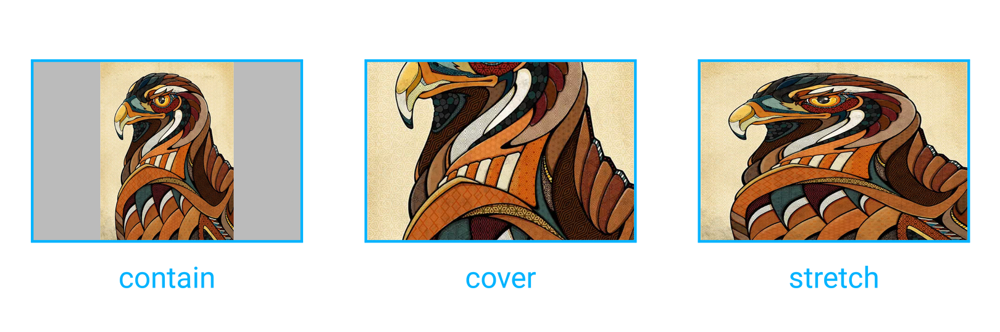

`<image>` is used to display a single image in your interface.

> **Note:**  `` element which is usually used in HTML is not supported in Weex, you should use `<image>` instead.

> **Note:**  Weex doesn't have built-in image downloader, as download, cache, decompression features are complicated and some open source tools like  [SDWebImage](https://github.com/rs/SDWebImage) handles it well, so please add native image adapter/handler before using `<image>`.
>
> See also:  [Android adapter](../android-apis.html#Adapter) and [iOS handler](../ios-apis.html#Handler-like-Android-Adapter).

## Basic Usage

> **Note:** the style attributes of `width` and `height` must be specified, otherwise it won't work.

```html
<image style="width:500px;height:500px" src="https://vuejs.org/images/logo.png"></image>
```

See the [example](http://dotwe.org/vue/00f4b68b3a86360df1f38728fd0b4a1f).

  ## Attributes

| Attribute     | Type   | Value                      | Default Value |
| ------------- | ------ | -------------------------- | ------------- |
| `placeholder` | String | {URL / Base64}             | -             |
| `resize`      | String | cover / contain / stretch  | stretch       |
| `src`         | String | {URL / Base64 }            | -             |

  > **Note:** you can specify a relative URL  for `src` and `placeholder`, relative URL will be rewritten to the to the actual resource URL (local or remote). See also: [Path](../../guide/advanced/path.html).

  ### `placeholder`

A URL value for placeholder image. It will be displayed when the image view is empty and will be replaced as soon as the 'src' image gets loaded.[(Example)](http://dotwe.org/vue/712ef102fc5e073b6c7e3b701545681c)

  ### `resize`



- `contain`: Scales the image as large as possible without cropping or stretching it. Remaining area within bounds is transparent ([Example](http://dotwe.org/vue/89be94dcd1fec73b77246ec46c678914))


- `cover`: Scales the image as large as possible without stretching it. If the proportions of the image differ from the element, it is cropped either vertically or horizontally so that no empty space remains.  ([Example](http://dotwe.org/vue/f38e311d2e6b2af87f0a65a8f37d9490))

-   `stretch`: `Default value`. Scales the content to fit the size of the element itself by changing the aspect ratio of the image if necessary. ([Example](http://dotwe.org/vue/f38e311d2e6b2af87f0a65a8f37d9490))

See also: [`background-size`](https://developer.mozilla.org/en-US/docs/Web/CSS/background-size).

### `src`

The URL of the image to display. This attribute is mandatory for the `<image>` component.

#### Supported Image Formats

Weex doesn't give a list of image formats that must be supported, it mainly relies on the image adapter/handler you are using. For example, if you are using [SDWebImage](https://github.com/rs/SDWebImage#supported-image-formats) as the image adapter on iOS, you can use image formats like JPEG, PNG, GIF, WebP, etc.

## Component Methods

### `save` <span class="api-version">v0.16.0+</span>

Save `<image>` content to the local device or photo album, this operation may require device permission.

**Parameters**:

* `callback`: {Function}  A function which is called after the image has been saved to the local device or photo album. Callback parameters:
  * `result`: {Object} Callback result whose properties are:
    * `success`: {Boolean}  A flag indicating whether the image has been saved completed.
    * `errorDesc`: {String} A string containing the description of the error if image is not written successfully.

**Return value**: null

> **Note**: You must add `NSPhotoLibraryAddUsageDescription` and `NSPhotoLibraryAddUsageDescription` (iOS 11) to enable the access permission of the iOS photo album. See also: [Cocoa Keys](https://developer.apple.com/library/content/documentation/General/Reference/InfoPlistKeyReference/Articles/CocoaKeys.html).

#### Use `save` Method

Add `ref` attribute (Vue.js *[Child Component Refs](https://vuejs.org/v2/guide/components.html#Child-Component-Refs)*) on `<image>`:

```html
<image ref="poster" src="path/to/image.png"></image>
```

Get the component reference and use the `save` method:

```js
const $image = this.$refs.poster
$image.save(result => {
  if (result.success) {
    // Do something to hanlde success
  } else {
    console.log(result.errorDesc)
    // Do something to hanlde failure
  }
})
```

Complete example goes [here](http://dotwe.org/vue/fadcd44a7031943ff0feaaf1895df414).

## Events

Support **[common events](../../wiki/common-events.html)**.

### `load`

`load` event handler will be called when the image is loaded.

**Event object**:

- `success`: {Boolean} It shows that whether the image is loaded successfully.
- `size`: {Object} The loaded image size whose properties are:
  - `naturalWidth`: {Number} The intrinsic width of image displayed on device,  it will be zero if the specified image cannot be loaded correctly.
  - `naturalHeight`: {Number} the intrinsic height of image displayed on device, it will be zero if the specified image cannot be loaded correctly.

#### Handle `load` Event

Bind `load` event on `<image>`:

```html
<image @load="onImageLoad" src="path/to/image.png"></image>
```

Add event handler:

```js
export default {
  methods: {
    onImageLoad (event) {
      if (event.success) {
        // Do something to hanlde success
      }
    }
  }
}
```

Complete example goes [here](http://dotwe.org/vue/94de9307517240dec066d2ea57fe54a0).

## Styles

Support **[common styles](../../wiki/common-styles.html)**.

## Usage Notes

- Add image adapter/handler before using `<image>`
- The `width` and `height` in the styles of `<image>` must be specified.
- `<image>` can not have any nested child component.

## Examples

- [Base64 example](http://dotwe.org/vue/ba477790c85ea12bbf7ad3a5f0885b5c)
- [Multi-layer images example](http://dotwe.org/vue/c44359c0f200abc1f66504b88587e4f6)
- [Lazy load image example](http://dotwe.org/vue/b0b146e4e6fa4890f800e18cb950f803)
