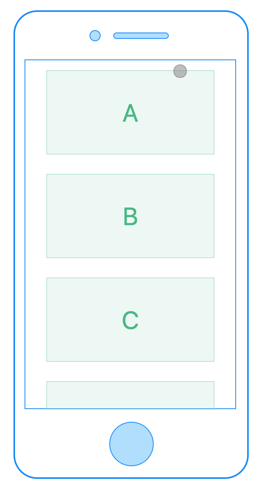

# &lt;list&gt;

## Summary

The List component, which inspired by Android RecyclerView, is a core component, and it provides the most popular features for using a list of items. which support vertical and horizontal list.

It can provide excellent experience and performance while still maintaining smooth scroll and low memory usage.

[list simple demo](http://dotwe.org/vue/edd19cdf2f03fbe857b76fadd65a08c3)



[list loadmore demo](http://dotwe.org/vue/2170622cc99895e5ad6af89d06355b84)

[list sticky header](http://dotwe.org/vue/2ecfe0a1c7b820c9d9c9965e1a8cde19)

[list cell appear event](http://dotwe.org/vue/ce0e953112b132e5897725b3149f3924)


## Child Components

Notes: The list now supports the following child components: cell, header, refresh, loading and fixed-position components. Other kinds of components will not be guaranteed to be displayed correctly.

* cell defines the attributes and behavior of the cells that appear in list.
* header sticks to the top when it reaches the top of the screen.
* refresh used inside list to add pull-down-to-refresh functionality.
* loading used inside list to add pull-up-to-load-more functionality.


## Attributes

* `show-scrollbar`: true/false whether show the scroll bar or not, default value is true
* `loadmoreoffset` : `Number` default value is 0. The loadmore event will be triggered when the list is loadmoreoffset left to reach the bottom of the list view. e.g. a list has total content length of 1000, and the loadmoreoffset is set to 400, the loadmore event will be triggered when 600 has beed scrolled and there is less than 400 left.
* `loadmoreretry` : `Number` default value 0，whether to reset loadmore related UI when loadmore failed, will be deprecated in further release.
* `offset-accuracy`：`Number` default value is 0, the vertical offset distance required to trigger the scroll event.
* `pagingEnabled`: `Boolean` default value is false. supporting pager style snapping in vertical orientation. support version: <Badge text="v0.20+" type="warning"/>. Example : [pagingEnabled](http://dotwe.org/vue/1323c218072f17f10e14a5c336dac3c4)
* scrollable: `Boolean` default value is true.  set whether list is scrollable.

Please checkout [Scroller Component Attributes](./scroller.html) to have a look at the inherited attributes from direct parent.

## Styles


common styles: check out [common styles for components](/docs/styles/common-styles.html)

* support flexbox related styles
* support box model related styles
* support position related styles
* support opacity, background-color etc.

## Events

onloadmore  0.5 used with loadmoreoffset attribute. if the view has less than loadmoreoffset to scroll down, the onloadmore event will be triggered.

scroll  <sup class="wx-v">0.12+</sup> used with offset-accuracy attribute. This event is fired when the list scrolls. The current contentOffset value is given in this event callback. See details in [scroll event demo](http://dotwe.org/vue/9ef0e52bacaa20182a693f2187d851aa).

common events: check out the [common events](/docs/events/common-events.html)

* support onclick event. Check out [common events](/docs/events/common-events.html)
* support onappear / ondisappear event. Check out [common events](/docs/events/common-events.html)


## API

All cells or cell's subcomponents in list support the scrollToElement API in [dom module](../modules/dom.html)

#### Difference between loading child component and onloadmore event

loading is a child component that can response to the onloading  event, and this event can only be triggered when the  scroller/list has been scrolled down to the bottom.
onloadmore is an event that will be triggered when the rest of the scroller/list is less than loadmoreoffset long.

## Restrictions

Nested lists or scrollers within the same direction are not supported. In other words. nested lists/scroller must have different directions.
For example, a vertical list nested in a vertical list or scroller is not allowed. However, a vertical list nested in a horizontal list or scroller is legal.


[load more demo](http://dotwe.org/vue/d31c85e7cd2dc54fa098e920a5376c38)

## Rax Example

`rax-recyclerview` is the component `<list>` of rax, which can run in web and weex.

```jsx
import { createElement, Component, render } from 'rax';
import View from 'rax-view';
import Text from 'rax-text';
import Driver from "driver-universal"
import RecyclerView from 'rax-recyclerview';

function Thumb() {
  return (
    <RecyclerView.Cell>
      <View style={styles.button}>
        <View style={styles.box} />
      </View>
    </RecyclerView.Cell>
  );
}
let THUMBS = [];
for (let i = 0; i < 20; i++) THUMBS.push(i);
let createThumbRow = (val, i) => <Thumb key={i} />;

function App() {
  return (
    <View style={styles.root}>
      <View style={styles.container}>
        <RecyclerView
          style={{
            height: 500
          }}>
          <RecyclerView.Header>
            <Text>Sticky view is not header</Text>
          </RecyclerView.Header>
          <RecyclerView.Header>
            <View style={styles.sticky}>
              <Text>Sticky view must in header root</Text>
            </View>
          </RecyclerView.Header>
          {THUMBS.map(createThumbRow)}
        </RecyclerView>
      </View>
    </View>
  );
}

let styles = {
  root: {
    width: '750rpx',
  },
  container: {
    padding: '20rpx',
    borderStyle: 'solid',
    borderColor: '#dddddd',
    borderWidth: '1rpx',
    marginLeft: '20rpx',
    height: '1000rpx',
    marginRight: '20rpx',
    marginBottom: '10rpx',
  },
  button: {
    margin: '7rpx',
    padding: '5rpx',
    alignItems: 'center',
    backgroundColor: '#eaeaea',
    borderRadius: '3rpx',
  },
  box: {
    width: '64rpx',
    height: '64rpx',
  }
};

render(<App />, document.body, { driver: Driver });
```

[rax-recyclerview doc](https://rax.js.org/docs/components/recyclerview)

