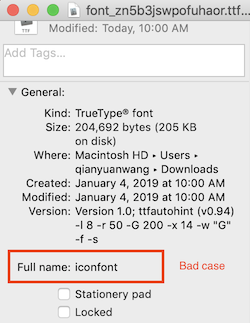

# &lt;text&gt;

## Summary

`<text>` is used to render text with specified styles.

:::warning
This component supports no child components.
:::

:::tip
The heading and trailing white spaces will be ignored. If this is not what you need, you can set text using data-binding method demonstrated below.
:::

## Styles
* Support [common styles](../styles/common-styles.html)
* Support [text styles](../styles/text-styles.html)

## Attributes
Except for dynamic text, there is no other supported attributes for text.

### Dynamic text
One can use the following code snippet to bind the content of text to a variable.

```html
<template>
  <div>
    <text >{{content}}</text>
  </div>
</template>
<script>
  module.exports = {
    data: function(){
      return {
          content: "Weex is an cross-platform development solution that builds high-performance, scalable native applications with a Web development experience. Vue is a lightweight and powerful progressive front-end framework."
      }
    }
}
</script>
```

## Events
* Support [common events](../events/common-events.html)

## Other
### Text height
The rules for computed height of text component is complicated, basically but not always, text in Weex obey the following rules in order:
1. The CSS style of `max-height`/`min-height` on your text
2. The CSS style of `flex` on your text if there is a `flex-direction:column` on the parent component of you text.
3. The CSS style of `height` on your text
4. The CSS style of `align-items:stretch` on your text if there is a `flex-direction:row` on the parent you text.
5. The content of your text and [text styles](../styles/text-styles.html) on your text.
6. Other related CSS styles not mentioned here.

### Custom Typeface <Badge text="v0.12+" type="warning"/>

Text component supports loading custom fonts in `ttf` file formats. 
1. Create your font with unique `font-family` name.
2. Using [addRule](../modules/dom.html#addrule-type-contentobject) method of dom module to register your font.
3. Set `font-family:YourFontFamilyName` style for your text component.

:::warning iOS compatibility
You can name fontFamily in addRule as you wish in your page, any string is OK. But this is not the real font-family name of the font file. The real name or system name for the font is stored in binary data of font file. You must ensure that the real font-family name of font file is unique. Or your font may not be successfully registered to device and your text may display as a ‘?’. To get the real name of a font file on Mac, right click on the file in Finder and inspect the file info. This image shows a BAD CASE. You should never use `iconfont` as family-name.

Specially, if you are using [Alibaba Iconfont](http://www.iconfont.cn/) to build your iconfont. Make sure that you set a unique enough font-family name for your font in project settings.


:::

### word-break
The word-break behavior is unpredictable and ROM dependent. Actually, the word-break strategy relies on `Minikin`, which is highly inconsistent cross different Android ROMs, you should not rely its behavior.

:::warning Android compatibility
Generally speaking, you would meet inconsistent word-break behavior if one of the following conditions meets:
* Mix Chinese/Japanese/Korean (CJK) text and other text, the inconsistent word-break behavior would happen on the intersection text of multiple languages.
* Mix half-width and full-width among non-CJK text, the inconsistent word-break behavior would happen on the intersection text of half-width and full-width text.
:::

::: tip hack into word-break
Developers could add `\uFEFF` namely [ZERO WIDTH NO-BREAK SPACE](http://jkorpela.fi/chars/spaces.html) just after the character with inconsistent word-break behavior to force no-break strategy, ref [demo](http://dotwe.org/vue/88a4b46f0dc1d1f6d82c506f490029ce) to see more detail。`\uFEFF` may not work on all Android ROMs, as some of them may just ignore it.
:::

## Example
* [Basic usage for `<text>`](http://dotwe.org/vue/7d2bf6e112ea26984fd5930663f092e0).
