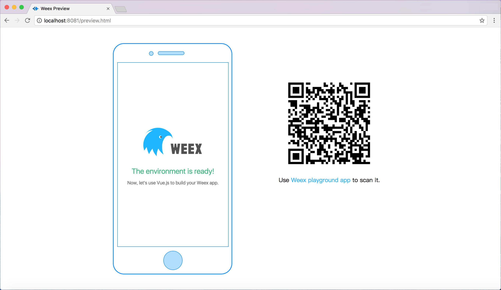

# Create Your Own App

> The following steps assume basic knowledge of Node.js and npm. If you are not familiar with them, you can visit [https://docs.npmjs.com/](https://docs.npmjs.com/) to learn more about npm, and [https://nodejs.org/en/docs/](https://nodejs.org/en/docs/) to learn more about Node.js.

Weex provides a command line tool, the [weex-cli](./weex_cli.html), to help developers get start easily. The CLI can help you create a starter project, setup iOS and Android development environments, debug, install plugins, and so on.

Currently, the `weex-cli` only supports the creation of Vue.js project. The `rax-cli` may be helpful if you want to use Rax. Please visit [Rax's official website](https://alibaba.github.io/rax/) for more details.

::: tip
`rax-cli` is a third party plugin, and is not developed nor maintained by Apache Weex.
:::

## Set up

With [Node.js](https://nodejs.org/) installed, install `weex-cli` CLI globally.

```bash
npm install weex-toolkit -g
```

This will add the `weex` command to your global path, and will allow you to generate new projects with the `weex create <project-name>` command.
Use `weex create` to create a starter project:

```bash
weex create awesome-app
```

After doing that, a standard **Weex + Vue.js** project will be generated inside the `awesome-app` folder in the current path.

## Develop

The next step is to navigate into the generated directory, install dependencies, and start:

```bash
cd awesome-app
npm install
npm start
```

`npm start` will start a web server on port `8081`. Open `http://localhost:8081` in your browser of choice to see the rendered result of your Weex app. The source code is located in `src/` folder. You can develop it as a normal Vue.js project.



Additionally, you can open `http://localhost:8081/web/preview.html` to preview the rendered result on the web in an iframe. You can also scan the QR code generated on the right using the [Weex playground app](/tools/playground.html) to see the rendered result on the mobile device.

## Build and Run

By default, the `weex create` command doesn't create the iOS and Android project, but you can use `weex platform add` to add them.

```bash
weex platform add ios
weex platform add android
```

Depending on your network environment, it may take a while to add them. Please be patient.

In order to develop the app on your local machine, you need to set up a mobile development environment. For iOS, you should install [Xcode](https://developer.apple.com/xcode/). For Android, you should install [Android Studio](https://developer.android.com/studio/index.html). When the development environment is ready, run the commands below to launch your app on the simulator or the device.

```bash
weex run ios
weex run android
weex run web
```

## Debug

The `weex-toolkit` can also be used to debug your mobile apps. Just run:

```bash
weex debug
```

`weex debug` will start a debug server and open a web page in Chrome (only support V8 engine). For more technical details of `weex-toolkit`, please refer to the [toolkit document](./weex_cli.html).