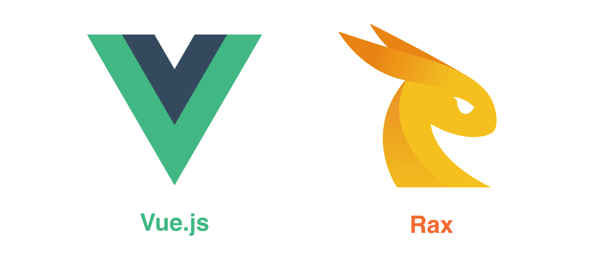

# Front-end Frameworks in Weex



Front-end technologies seem flourishing and productive. Using front-end frameworks in production is a good way to write maintainable apps.

However, **Weex is not a front-end framework**. Indeed, front-end frameworks are just the syntax layer or DSL (Domain-specific Language) of Weex, they are decoupled from native render engines. In another word, Weex does not rely on any specific front-end frameworks. With the evolution of the technology, Weex can integrate more widely used front-end frameworks as well.

Currently, Weex mainly supports [Vue.js](https://vuejs.org/) and [Rax](https://alibaba.github.io/rax/), and those frameworks are already integrated into Weex SDK, you don't need to require them manually.

> **Learn some basics of Vue.js or Rax could be very helpful when you are using Weex.**

It is better to learn some basics of Vue.js or Rax before using Weex.

## Framework Type Annotation

Weex only determined which front-end framework is used of a specific page at runtime (just before rendering the page). So you have to mark what type of front-end framework you are using in the js bundle.

### Using Comment

In v0.16 and earlier, Weex is using specific format comments to annotate the framework type, the format is `// { "framework": "Xxx" }`, the `Xxx` in it is the name of front-end framework.

> NOTICE: **The comment type annotation must be placed at the beginning of the code.** Only spaces or blank lines can be put before it.

For example, the comment type annotation of Vue is:

```js
// { "framework": "Vue" }
```

The comment type annotation of Rax is:

```js
// { "framework": "Rax" }
```

### Using Directive Prologue <badge text="0.17+" type="warn" vertical="middle"/>

Using comments is not a robust way to declare the framework type, because it may be removed during compiling or packaging. Since the v0.17, Weex supports using [Directive Prologue](http://ecma-international.org/ecma-262/5.1/#sec-14.1) to indicate the framework type. The format of directive prologue type annotation is `"use weex:xxx";`, the `Xxx` in it is the name of front-end framework. Both `'` (single quote) and `"` (double quotes) are fine, but must be lower case.


> NOTICE: **The directive prologue type annotation must be placed before all runnable codes.** Only spaces, blank lines or comments can be put before it.

For example, the directive prologue type annotation of Vue is:

```js
"use weex:vue";
```

The directive prologue type annotation of Rax is:

```js
"use weex:rax";
```

### Be Compatible with All Versions of Weex

If you are using v0.17 or higher version of Weex SDK, recommend you to use `"use weex:xxx";` as the type annotation. But if consider to be compatible with all versions of Weex, you can use both comments and directive prologue.

For example, the compatible type annotation of Vue is:

```js
// { "framework": "Vue" }
"use weex:vue";
```

The compatible type annotation of Rax is:

```js
// { "framework": "Rax" }
"use weex:rax";
```

## Vue.js

Weex integrated the v2 version of Vue.js since WeexSDK [v0.10.0](https://github.com/alibaba/weex/releases/tag/v0.10.0) is released at 2017/02/17. Vue (pronounced /vjuː/, like view) is a progressive front-end framework for building user interfaces. Please refer to its [official website](https://vuejs.org/) for more information.

::: tip
Please refer to [Use Vue.js in Weex](./use-vue-in-weex.html) document to learn more technics about Weex and Vue.
:::

## Rax

Rax is a front-end framework with React-compatible APIs.Please refer to [Rax's official website](https://alibaba.github.io/rax/) to get more information.

::: tip
Please refer to [Use Rax in Weex](./use-rax-in-weex.html) document to learn more technics about Weex and Rax.
:::
