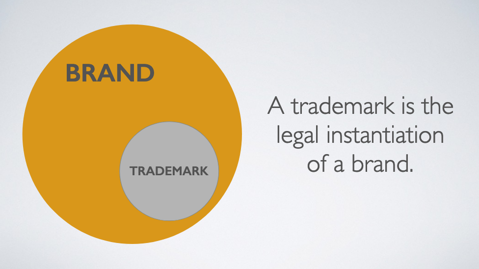

# 引言
先回答文章标题的问题，我的观点是 **Brand 是开源项目最重要的资产。**

最近 Weex 在 Apache Incubator 中受到了一些挑战，这些挑战触发了我的一些思考，故写下这篇文章。这篇文章不涉及具体的技术或项目，而是从更高的抽象维度，阐述开源这件事情。

# 开源的三重境界
## 当我们在谈论开源时，我们在谈论什么？
一个开源项目，在概念上可以认为由以下三个部分组成：
* Code
* Community
* Brand

在大多数情况下，我们在谈论开源项目时，我们是在谈论它的 Code 。然而 Code 实际上是一个开源项目中，最不重要的部分，或者至少可以说，Code 远没有 Community 与 Brand 重要。每个人都可以下载并修改 Code，并且基于其修改进行二次分发与构建。因此，开源项目的 Code 具有 **forkable** 的属性。

Community 驱动着一个开源项目的发展，是一个项目的发动机。Community 是一群人，因为各自的原因，聚集在一起，做一个项目。Community 是人的集合，而人会来也会走。如果人走光了，那么就剩下了一个 Dead Community，项目也自然变成了 Dead Project (*当然，一些公司可能在继续维护某些 Dead Project 的内部版本，不在本文讨论范围内*)。因此，社区具有 **changeable** 的属性。

Brand 包含项目名称、Logo 和其他一些内容。开源在某种程度上是一门眼球生意，而 Brand 则是做这门生意的手段。因此，Brand 具有**不可 fork, unchangeable** 的属性，这是 Code 与 Community 并不具备的。

## 三重境界
根据开源项目的三个层级，可以列出下面的开源的三种境界：
1. Open Source Code
2. Open Governance Model
3. Open brand (Trademark)

如果一个项目的代码处于 [OSI Approved License](https://opensource.org/licenses)(如 MIT, Apache, BSD等) 授权下，就可以认为它是开源项目，也就是**第一重境界**。这是 GitHub 上大部分开源项目所处的境界。

如果一个项目的 Governance Model 也是开放的（哪怕是 BDFL），那么就可以认为达到了开源的**第二重境界**。Apache Software Foundation, Node.js Foundation, Linux Foundation, Cloud Native Computing Foundation 等开源基金会下的项目，及 Python 等知名项目都可以认为达到了这个境界。(*下文将详细阐述 Governance Model 的概念*)。

如果一个项目的 Trademark 是属于某个非营利组织(*如开源基金会*)的话，那么可以认为它达到了第三重境界。Apache Software Foundation 通过将旗下所有顶级项目在美国注册 Trademark 的方式，使其管理的顶级项目均达到了**第三重境界**。相反，一些知名开源项目的 Trademark 属于个人或一家商业公司，*如三星通过控制 Joyent 而持有 Node.js 的 Trademark，Linus 个人则持有 LINUX 的 Tradmark*。

# Open Governance Model (开源治理)
Governance Model 是一个开源社区的组织方式，其内容包括项目的管理委员(*PMC*)的权利边界，新成员如何加入项目管理委员会，如何做决策(*是否采取投票机制，是否有否决票*)。常见的 Governance Model 有以下几种:
* [BDFL](https://en.wikipedia.org/wiki/Benevolent_dictator_for_life)
* [Meritocracy](http://oss-watch.ac.uk/resources/meritocraticgovernancemodel)
* [Liberal contribution](https://medium.com/the-node-js-collection/healthy-open-source-967fa8be7951)

上述这些 Governance Model 是开源项目常采用的模型，这些模型适用不同场景，彼此之间并没有优劣之分。一个项目只要对外公开了其采用的 Governance Model，并践行了这些规则，按照规则选出新的 Committer 并赋予其权利，那么就可以认为这个项目实现了 Open Governance Model，*即使其采用了 BDFL*。

除了上述的几种 Governance Model，由某家公司发起的开源项目还可能采用 Cooperate Centric Model，即公司主导。对于这种采取这种模式的项目，如果你不是这家公司的雇员，你对其开源项目的贡献很可能不被重视，你也无法获得 committer 权利并决定项目的发展。通常来说，这不是一种好的 Governance Model，然而很多由公司主导的开源项目会选择这种模式。

# Brand & Trademark
## Brand 与 Trademark 的关系
开源是一门**眼球**生意，开源项目通过 Brand 吸引新用户，并将用户转化为贡献者与 Committer。项目 Brand 越知名，意味着项目的参与者越多，活跃度也越高，演进的速度也越快。

Trademark 可以看作是 Brand 的实例化。Trademark 一般和某种特定的符号相关联，常见表现形式为名字或 Logo。

## Why it matters?
对于开源软件的消费者而言，Trademark 确保了他们可以从期望的软件生产者那里下载到期望的源代码(或二进产物)，而不是一些冒名顶替的产物。Trademark 是开源软件的生产者与消费者之间的纽带，确保了开源软件的消费者能下载并他们所期待的产品(源代码或二进制)，而不是山寨产品。

**谁拥有了 Trademark，谁就能控制开源软件消费者与生产者之间的关系。**

一般而言，Trademark 受到国家法律保护，而 Brand 并不受法律保护。因此，Trademark 的所有者可以通过法律手段禁止其他人/组织使用其 Trademark.

**Trademarks are not forkable.**

开源的代码可以fork，开源的社区经常改变，而 Trademark 是**不可fork**，**不可改变的**。因此，Trademark 是变化中的不变，是一个开源项目最重要的资产。

## Open brand
一般来说，一个 Trademark 的拥有者可能有如下形式：
* 个人
* 一家商业公司
* 非营利组织
    * 中国慈善法中的民办非企业
    * 美国 501C6，501C3 类型的组织
    * 符合其他国家法律的非营利组织

对于前两种情况，一旦 Trademark 的持有人拒绝提供其授权，项目就会存在法律风险。举例来说， Docker, Inc.(*一家商业公司*) 持有了 Docker 的 Trademark，并曾在 Github 上向[不当使用](https://www.docker.com/legal/trademark-guidelines) Docker Trademark 的开源项目发出过大量律师函，要求这些项目作者(*创建了如Docker XXXXXX等项目*) 停止侵权行为。

而像 Apache Software Foundation，则属于第三种情况。Apache Software Foundation 会为其所管理的所有顶级项目在美国注册 Trademark ，并将 Trademark 的管理权交给项目的 PMC，即项目的开发者通过 Apache Software Foundation 授权的方式，获得了Trademark 的管理权。

最后，再重复一下本文最开始的观点，**Brand 是开源项目最重要的资产。**

# 后记
本文写作的契机来源于 [COSCon‘ 2019](https://www.bagevent.com/event/5744455) 中的观点碰撞，会议嘉宾们的一些观点与本文主旨无关，但值得进一步思考，故写在后记中。
* 开源项目并不只是写代码，有很多非代码内容，需要工程师、产品经历、运营等多种角色参与，很多时候一个工程师同时去扮演上述三种角色是很难的。
* 要把开源项目当作一个产品来打造，而不仅仅是技术与代码。
* 目前开源项目大多集中在 Infrastructure 层面，缺少 Application 层的开源项目，而这些 Infrastructure 的工作无法产生直接的经济回报。**The OSS contributors are not well paid, they just do things for fun.** 基于公链的区块链项目，有可能做到 Application 层开源的同时，还能给作者提供良好的经济回报。

## 作者信息
YorkShen

Apache Weex PPMC member

shenyuancs@gmail.com

# 参考文献
* [Who Owns That FOSS Brand?](http://shaneslides.com/fossbackstage/Who-Owns-That-FOSS-Brand.pdf)
* [Leadership and Governance](https://opensource.guide/leadership-and-governance/)