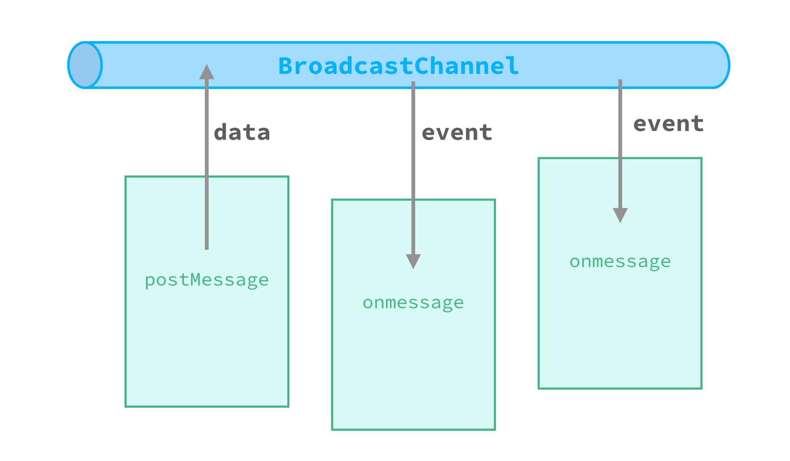

<!-- toc -->

> `BroadcastChannel` 接口在 <span class="api-version">v0.9+</span> 及以上的版本中可用。

在 [Weex 和 Web 的平台差异](../../guide/platform-difference.html)中提到过，不同的 Weex 页面使用的是不同的执行环境，即使全局变量也是互相隔离的，然而使用 `BroadcastChannel` 是可以实现跨页面通信的。

## API

> *BroadcastChannel* 是 [W3C 规范](https://html.spec.whatwg.org/multipage/comms.html#broadcasting-to-other-browsing-contexts)中的一部分，其中依赖的 [MessageEvent](https://html.spec.whatwg.org/multipage/comms.html#messageevent) 对象也是。

`BroadcastChannel` 的构造函数只接受一个参数，那就是“频道名称”（channel name）。

```js
const bc = new BroadcastChannel('007')
```

`BroadcastChannel` 接口的定义如下：

```typescript
declare interface BroadcastChannel = {
  name: string,
  postMessage: (message: any) => void;
  onmessage: (event: MessageEvent) => void;
  close: () => void;
}
```

+ `name`: 监听的频道名称，用来区分不同的频道（跨频道不可通信）。
+ `postMessage`: 用于在当前频道中广播消息。
+ `onmessage`: 消息事件的处理函数。在频道中接收到广播消息之后，会给所有订阅者派发消息事件。
+ `close`: 关闭当前频道。

消息对象（`MessageEvent`）的类型定义如下：

```typescript
declare interface MessageEvent = {
  type: string, // "message"
  data: any
}
```

## 通信过程



就像使用无线电一样，每个页面通过创建一个具有相同频道名称的 BroadcastChannel 对象来加入特定频道。 然后实现 `onmessage` 接口来监听消息事件。通过调用 BroadcastChannel 对象上的 `postMessage()` 方法可以在频道中广播一条消息给所有订阅者。

事实上，这是在特定频道的所有用户之间的全双工（双向）通信，每个订阅者都可以在频道中彼此收发任何消息，即使消息的发送者也能收到自己发出的消息事件。不同频道之间的通信过程是不会互相影响的。

调用 BroadcastChannel 对象的 `close()` 方法可以离开一个频道，这个方法只关闭自己，并不影响其他订阅者。当某个 Weex 页面被销毁时，其中的所有订阅者将在 `destroyInstance` 中强制关闭。如果某个频道的所有用户都关闭了，这个频道对象将会被销毁，所占内存页能被回收。

## 使用范例

在页面 A 中：

```js
const Steve = new BroadcastChannel('Avengers')
Steve.postMessage('Assemble!')
```

在页面 B 中：

```js
const Hulk = new BroadcastChannel('Avengers')
```

在页面 C 中：

```js
const Stark = new BroadcastChannel('Avengers')
Stark.onmessage = function (event) {
  console.log(event.data) // Assemble!
  Stark.postMessage('I am Tony and I am leaving now.')
}
```

页面 A 、B 、C 都创建一个监听了 `'Avengers'` 频道的 BroadcastChannel 对象，它们可以用这个对象实现互相通信。

当 Steve 发布了 `'Assemble!'` 消息时，Stark 将收到一个消息事件，其 `data` 字段等于 `'Assemble!'`，然后也向频道中回复一条消息。但是 Hulk 并不会收到这些消息，因为他没有实现`onmessage` 方法，相当于没有接收频道中的消息，所以他实际上不是一个订阅者。

> 注释: Hulk 不会收到他自己发送的消息

## 注意事项

> **消息事件中的对象并没有深度复制。**（这个特性可能会修改）

在页面 A 中：

```js
const a = new BroadcastChannel('app')
const list = ['A', 'B']
a.postMessage({ list })
```

在页面 B 中：

```js
const b = new BroadcastChannel('app')
b.onmessage = function (event) {
  // the `event.data.list` is a reference of `list` in page A
  event.data.list.push('C')
}
```

在这个例子中，页面 B 中的 `event.data.list` 实际上是页面 A 中 `list` 对象的引用。在页面 B 中给列表添加一项 `'C'`，也将影响到页面 A 中的 `list` 对象。

相比于深度复制，这个行为可以减少页面中的内存消耗。开发者在使用时不应该存储或修改 `event` 对象。
