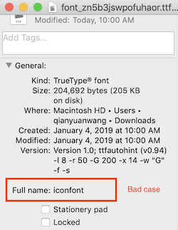

# &lt;text&gt;

## 简介

`<text>` 是 Weex 内置的组件，用来将文本按照指定的样式渲染出来.

::: warning
`<text>` 不支持子组件。
:::

::: tip
`<text>` 里直接写文本头尾空白会被过滤，如果需要保留头尾空白字符，暂时只能通过数据绑定的方式，见下面动态文本。
:::


## 样式
* 支持 [通用样式](../styles/common-styles.html)。
* 支持 [文本样式](../styles/text-styles.html)。

## 属性
除了动态文本，text组件不支持其他属性。

### 动态文本
下列代码片段可以实现文字内容和JS变量的绑定。

```html
<template>
  <div>
    <text >{{content}}</text>
  </div>
</template>
<script>
  module.exports = {
    data: function(){
      return {
          content: "Weex is an cross-platform development solution that builds high-performance, scalable native applications with a Web development experience. Vue is a lightweight and powerful progressive front-end framework."
      }
    }
}
</script>
```

## 事件
* 支持 [通用事件](../events/common-events.html)。

## 其他
### 文字高度
文字高度的计算规则比较复杂，但大致上遵循以下优先级进行计算，排在前面的优先级最高。
1. 文字节点的`max-height`/`min-height`样式。
2. 文字节点的`flex`属性且文字的父节点上有`flex-direction:column`样式。
3. 文字节点的`height`样式。
4. 文字节点的`align-items:stretch`如果文字父节点有 `flex-direction:row`样式。
5. 文字内容和文字本身的[样式](../styles/text-styles.html)。
6. 其他相关CSS属性。

### 自定义字体 <Badge text="v0.12+" type="warning"/>

文本组件支持 `ttf` 字体格式的自定义字体。
1. 使用唯一的 `font-family` 名字创建字体文件。
2. 使用 Dom 模块的 [addRule](../modules/dom.html#addrule-type-contentobject) 方法注册字体。
3. 在文本中使用 `font-family:YourFontFamilyName` 样式指定字体。

:::warning iOS 兼容性
addRule 方法里的 fontFamily 可以随意取，这个名字是 Weex 本地索引用的，并不是字体真正的名字。字体真正的名字（font-family），也就是注册到系统字库中的名字是保存在字体二进制文件中的。你需要确保你使用的字体的真正名字（font-family）足够特殊，否则在向系统注册时可能发生冲突，导致注册失败，你的字符被显示为‘?’。要获取字体名字，可以在字体文件上单击右键，显示文件信息。以下图片显示了一个不好的做法，记住，永远不要使用 `iconfont` 作为你字体的名字。

如果你使用 [Alibaba Iconfont](http://www.iconfont.cn/) 来构建你的 iconfont。确保在项目设置中，设置一个特殊的 font-family 名字。默认是 “iconfont”，但极大可能发生冲突。


:::

### word-break
word-break 行为是不可预测的且与 Android ROM 强相关。事实上，word-break 行为依赖 Android 系统的 `Minikin` 组件，而 `Minikin`在各个 Android ROMs 上差别很大，开发者不应该依赖其行为。

:::warning Android compatibility
一般来说，在下列场景下你可能会遇到 word-break 在不同机器上不一致的现象：
* 中文/日文/韩文(*即 CJK 文字*)与其他文字混合排布时，在 CJK 文字和其他文件相交区域可能会遇到 word-break 不一致的现象。
* 全角非 JCK 文字和半角非 CJK 文字混合时，全角和半角相交的地方可能会遇到 word-break 不一致的现象。
:::

::: tip hack into word-break
开发者可通过在意外换行处添加 `\uFEFF` 即 [ZERO WIDTH NO-BREAK SPACE](http://jkorpela.fi/chars/spaces.html) 以触发**强制不换行**，详细用法可参考[demo](http://dotwe.org/vue/88a4b46f0dc1d1f6d82c506f490029ce)。请注意这个方法**无法**保证在所有 Android ROM 上有效，一些 ROM 会忽略 *ZERO WIDTH NO-BREAK SPACE* 指令。
:::

## Vue 示例
* [`<text>`的基本用法](http://dotwe.org/vue/7d2bf6e112ea26984fd5930663f092e0)
  

## Rax 示例

`rax-text` 是 `<text>` 组件的上层封装，抹平了 Web 和 Weex 的展现

```jsx
import { createElement, render } from 'rax';
import Driver from "driver-universal";
import Text from 'rax-text';

function App() {
  return (
    <Text>Text</Text>
  );
}

render(<App />, document.body, { driver: Driver });
```

[rax-text 文档](https://rax.js.org/docs/components/text)

