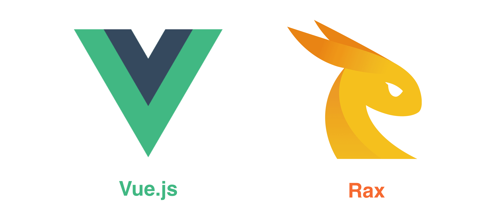

# Weex 中的前端框架

<!-- toc -->



前端技术看起来很繁荣，测试、打包、调试等工具都比较丰富，开发效率比原生开发要高很多。在大型项目中使用前端框架也是一个管理应用好方法，这样更方便于长期维护。

然而，**Weex并不是一个前端框架**。实际上，前端框架仅仅是 Weex 的语法层或称之为 DSL (Domain-specific Language)，它们与原生渲染引擎是分离的。换句话说，Weex 并不依赖于特定的前端框架，随着前端技术的发展，Weex 也可以集成更多广泛使用的前端框架。

目前 Weex 主要支持 [Vue.js](https://vuejs.org/) 和 [Rax](https://alibaba.github.io/rax/) 作为其内置的前端框架。这些框架已经集成到了 Weex SDK，你不需要在额外引入。

> **学习一些 Vue 和 Rax 的基础知识，对使用 Weex 非常有帮助。**

## 框架类型标记

Weex 仅在运行时（开始渲染页面之前）才会确定页面使用哪种 DSL，因此要在页面代码中标记使用的是哪种类型的前端框架。

### 使用注释标记

在 Weex v0.16 以及更早的版本中，使用特定格式的注释来标记框架类型，格式是 `// { "framework": "xxx" }`，其中的 `xxx` 指的是前端框架的名字（首字母大写）。

> 注意： **注释类型标记必须放在代码最前面。** 标记之前只能有空格或者空行，不能有其他类型的字符。

例如 Vue 框架的类型标记如下：

```js
// { "framework": "Vue" }
```

Rax 框架的类型标记如下：

```js
// { "framework": "Rax" }
```

### 使用字符串标记  <badge text="0.17+" type="warn" vertical="middle"/>

使用注释作为框架标记不够稳妥，在打包过程中有可能会被移除掉，因此从 v0.17 版本开始 Weex 支持使用 ECMAScript 规范中的“指令序言”（[Directive Prologue](http://ecma-international.org/ecma-262/5.1/#sec-14.1)）来标记各种前端框架的类型，标记的格式是 `"use weex:xxx";`，其中的 `xxx` 指的是前端框架的名字，兼容单引号和双引号，字符串内容保持小写。

> 注意： **字符串类型标记必须放在所有可代码之前。** 标记之前可以有空格、空行或者注释，但是不能有可执行的代码。

例如 Vue 框架的类型标记如下：

```js
"use weex:vue";
```

Rax 框架的类型标记如下：

```js
"use weex:rax";
```

### 兼容所有版本的写法

如果你集成 Weex SDK 都在 0.17 版本之上，建议使用 `"use weex:vue";` 作为框架类型标记。如果考虑兼容更早的版本，可以同时使用两种类型标记。

例如 Vue 框架的类型标记如下：

```js
// { "framework": "Vue" }
"use weex:vue";
```

Rax 框架的类型标记如下：

```js
// { "framework": "Rax" }
"use weex:rax";
```

## Vue.js

Weex 从 [v0.10.0](https://github.com/alibaba/weex/releases/tag/v0.10.0)（发布于 2017/02/17）这个版本开始，就集成了 v2 版本的 Vue.js。Vue.js 是一套用于构建用户界面的渐进式框架，详情请参阅其[官方网站](https://vuejs.org/)。

关于在 Weex 中使用 Vue 的技巧请参阅：[《在 Weex 中使用 Vue.js》](./use-vue-in-weex.html)。

## Rax

Rax 是一个兼容 React 接口的前端框架，请参考 [Rax 的官方网站](https://alibaba.github.io/rax/) 来获得更多信息。
