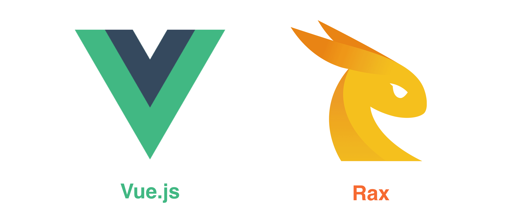

# 什么是 Weex ？

<!-- toc -->

> **Weex 是使用流行的 Web 开发体验来开发高性能原生应用的框架。**

Weex 致力于使开发者能基于通用跨平台的 Web 开发语言和开发经验，来构建 Android、iOS 和 Web 应用。简单来说，在集成了 WeexSDK 之后，你可以使用 JavaScript 语言和前端开发经验来开发移动应用。

Weex 渲染引擎与 DSL 语法层是分开的，Weex 并不强依赖任何特定的前端框架。目前 [Vue.js](https://vuejs.org/) 和 [Rax](https://alibaba.github.io/rax/) 这两个前端框架被广泛应用于 Weex 页面开发，同时 Weex 也对这两个前端框架提供了最完善的支持。Weex 的另一个主要目标是跟进流行的 Web 开发技术并将其和原生开发的技术结合，实现开发效率和运行性能的高度统一。在开发阶段，一个 Weex 页面就像开发普通网页一样；在运行时，Weex 页面又充分利用了各种操作系统的原生组件和能力。

## 概述

想初步了解 Weex 其实非常简单。

* 安装 [WeexPlayground](http://weex.apache.org/tools/playground.html). 在 Playground 里，你可以打开各种示例。
* 访问 [Weex online playground](http://dotwe.org/vue). 在这个网站上，你可以浏览、修改、新建各种基于 Vue.js 的[单页面]((https://vuejs.org/v2/guide/single-file-components.html))例子，并用 WeexPlayground 应用扫码查看实时效果。

这里有一个使用 Weex 和 Vue.js 开发的[最简单的例子](http://dotwe.org/vue/8da01827631b21150a12dd54d7114380)。你可以大致了解 Weex 是如何工作的。

在 `<template>` 部分，包含了 `
` 元素，这个被广泛应用于 Web 页面中，在 Weex 里它也是一个通用的容器。`<text>` 元素就和普通的 HTML 不太一样了，它提供了显示文本的能力，在 Weex 上，所有文本必须放在 `<text>` 标签中。

在 `<style>` 部分，你可以定义各种 CSS 样式。需要注意的是，这些样式在 Weex 里只能作用于当前组件，[**scoped**](https://vue-loader.vuejs.org/en/features/scoped-css.html)。

### 原生组件

在上面的例子中，`
` 和 `<text>` 在移动端上渲染出来的都是原生组件，充分利用了操作系统组件的能力与渲染速度。

Weex 提供了一套基础的[内置组件](../docs/components/div.html)。你可以对这些基础组件进行封装、组合形成自己的组件；也可以创建自己的全新组件来包装操作系统提供的地图、视频等功能。可以访问 [扩展 iOS 能力](./extend/extend-ios.html) 和 [扩展 Android 能力](./extend/extend-android.html)来了解如何去实现自定义组件。

在框架内部，Weex 使用原生组件来渲染，并尽可能保持多平台一致性。但在不同平台上，或多或少会有一些渲染、行为上的差异。比如对于 [`<switch>`](http://dotwe.org/vue/d96943452b6708422197c47920903823) 组件，在不同平台上的视觉效果是不一致的。

### 原生模块

对于那些不依赖于 UI 组件的功能，Weex 将它们包装成多个 **模块**，比如 [动画模块](../docs/modules/animation.html)。在前端代码中，使用 `weex.requireModule('xxx')` 引入一个模块，之后就可以调用它提供的各种方法。Weex 模块包装了网络、存储、剪切板、导航等各种功能供前端调用。比如你可以使用 [`stream`](http://dotwe.org/vue/2ae062b6a04124a35bbe2da3b1e5c07b) 模块来获取 Vue.js 的 Star 数量。

Weex 已经提供了不少[内置模块](../docs/modules/animation.html)，同时也支持将 App 特有的功能包装成自定义模块提供给前端调用。如果想了解怎么做，可以浏览以下文档。

* [扩展 Web 组件](./extend/extend-web.html)
* [扩展 Android 能力](./extend/extend-android.html)
* [扩展 iOS 能力](./extend/extend-ios.html)

### 一次编写，处处运行

Weex 的目标就是使用开发者基于一份代码，编写出可以运行在 iOS，Android 和 Web 上的应用，并最大化地提高开发效率和简化测试、构建、发布流程。

有一些场景，你可能仍然需要写一些平台相关的代码。Weex 提供 `WXEnvironment` 用来获取 Weex 运行的环境变量，浏览 [Weex 环境变量](../docs/api/weex-variable.html)，了解更多。

## 使用前端框架

Weex 应用需要依赖前端框架来编写，但 Weex 并没有绑定、限制在特定的框架上。目前 [Vue.js](https://vuejs.org/) 和 [Rax](https://alibaba.github.io/rax/) 是最广泛应用于 Weex 开发的前端框架，也是目前功能最全、最稳定的方案。

- **Vue.js** 是一个不断进化中的前端框架。
- **Rax** 是提供类 React 语法和兼容性的前端框架。

> Vue.js 和 Rax 都已经集成到 Weex 中，并默认提供。

将自己喜欢的前端框架和 Weex 进行结合是可以的，但并不是那么容易。我们也在不断开发和简化这种接入工作，如果想了解如何做，或有任何想法可以和我们联系。你也可以先阅读一下 [使用前端框架](./front-end-frameworks.html) 这篇文档了解它是做什么的。

## 下一步

当你看到这里的时候，我相信你已经了解了 Weex 的基本知识。下一步就是深入了解 Weex 的其他特性，并且动手试一试吧。

如果你想用 Weex 来开发自己的应用，请阅读

- [创建一个新的 App](./develop/create-a-new-app.html)
- [集成到 iOS 应用](./develop/integrate-to-iOS-app.html)
- [集成到 Android 应用](./develop/integrate-to-android-app.html)
- [设置开发环境](./develop/setup-develop-environment.html)

如果你想为 Weex 贡献自己的力量，比如提交代码、修改文档或提交一些 Bug，可以阅读

- [How to Contribute](./contribute/how-to-contribute.html)
- [Bug Report Guidelines](./contribute/bug-report-guidelines.html)
