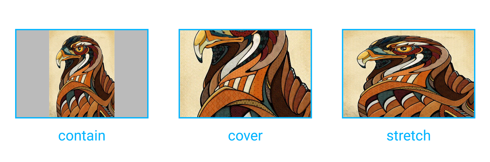

`<image>` 用于在界面中显示单个图片。

> **注意：**在HTML中通常使用的 `` 标签在 Weex 中不支持，你应该使用`<image>` 。

> **注意：** Weex 没有内置的图片下载器，因为相关的下载、缓存、解码机制非常复杂，一些开源的工具如 [SDWebImage](https://github.com/rs/SDWebImage) 已经处理得很好， 所以在使用 `<image>` 之前，请在 native 侧先接入相应的 adapter 或者 handler。
>
> 参见:  [Android adapter](../android-apis.html#Adapter) 和 [iOS handler](../ios-apis.html#Handler-like-Android-Adapter)。

## 基本用法

> **注意：** 必须指定样式中的宽度和高度，否则无法工作。

```html
<image style="width:500px;height:500px" src="https://vuejs.org/images/logo.png"></image>
```

参见[示例](http://dotwe.org/vue/00f4b68b3a86360df1f38728fd0b4a1f)。

## 属性

| 属性名           | 类型     | 值                          | 默认值     |
| ------------- | ------ | -------------------------- | ------- |
| `placeholder` | String | {URL / Base64}             | -       |
| `resize`      | String | cover / contain / stretch | stretch |
| `src`         | String | {URL / Base64 }            | -       |

> **注意：**您可以指定一个相对 bundle URL 的相对路径，相对路径将被重写为绝对资源路径(本地或远程)。参见: [资源路径](../../guide/advanced/path.html)。

### `placeholder`

占位图的 URL，当由 `src` 表示的图片下载完成并展示后将被删除。 ([示例](http://dotwe.org/vue/712ef102fc5e073b6c7e3b701545681c))

### `resize`



- `contain`：缩放图片以完全装入`<image>`区域，可能背景区部分空白。 ([示例](http://dotwe.org/vue/89be94dcd1fec73b77246ec46c678914))
- `cover`：缩放图片以完全覆盖`<image>`区域，可能图片部分看不见。 ([示例](http://dotwe.org/vue/f38e311d2e6b2af87f0a65a8f37d9490))
- `stretch`：`默认值`. 按照`<image>`区域的宽高比例缩放图片。([示例](http://dotwe.org/vue/f38e311d2e6b2af87f0a65a8f37d9490))

参见: [`background-size`](https://developer.mozilla.org/en-US/docs/Web/CSS/background-size).

### `src`

要显示图片的 URL，该属性是 `<image>` 组件的强制属性。

#### 支持的图片格式

Weex没有提供必须支持的图片格式列表，主要依赖于你正在使用的图片 adapter 或者 handler。例如，如果你使用 [SDWebImage](https://github.com/rs/SDWebImage#supported-image-formats) 作为iOS上的图片 handler，你可以使用像 JPEG、PNG、GIF、WebP 等图片格式。

## Component 方法

### `save` <span class="api-version">v0.16.0+</span>

保存图片内容到本地文件或相册，此操作可能需要设备相关权限。

**参数**:

* `callback`：{Function} 在图片被写入到本地文件或相册后的回调，回调参数：
  * `result`：{Object} 回调结果对象，属性列表：
    * `success`：{Boolean} 标记图片是否已写入完成。
    * `errorDesc`：{String} 如果图像没有成功写入，该字符串包含了详细的错误描述。

**返回值**: null

> **注意**: 你必须加入`NSPhotoLibraryAddUsageDescription` 和 `NSPhotoLibraryAddUsageDescription` (iOS 11) 以获得访问 iOS 系统相册权限. 参见: [Cocoa Keys](https://developer.apple.com/library/content/documentation/General/Reference/InfoPlistKeyReference/Articles/CocoaKeys.html)

#### 使用 `save` 方法

在 `<image>`标签上增加 `ref` 属性 (Vue.js *[Child Component Refs](https://vuejs.org/v2/guide/components.html#Child-Component-Refs)*) ：

```html
<image ref="poster" src="path/to/image.png"></image>
```

获取组件引用并使用 `save` 方法:

```js
const $image = this.$refs.poster
$image.save(result => {
  if (result.success) {
    // Do something to hanlde success
  } else {
    console.log(result.errorDesc)
    // Do something to hanlde failure
  }
})
```

参见 [完整例子](http://dotwe.org/vue/fadcd44a7031943ff0feaaf1895df414).

## 事件

支持 **[通用事件](../../wiki/common-events.html)**.

### `load`

当加载完成 `src` 指定的图片时，`load`事件将被触发。

**事件对象**:

- `success`: {Boolean} 标记图片是否成功加载。


- `size`: {Object} 加载的图片大小对象，属性列表：
  - `naturalWidth`: {Number} 图片宽度，如果图片加载失败则为0。
  - `naturalHeight`: {Number} 图片高度，如果图片加载失败则为0。

#### 处理 `load` 事件

在 `<image>` 标签上绑定 `load` 事件：

```html
<image @load="onImageLoad" src="path/to/image.png"></image>
```

增加事件处理函数：

```js
export default {
  methods: {
    onImageLoad (event) {
      if (event.success) {
        // Do something to hanlde success
      }
    }
  }
}
```

参见[完整示例](http://dotwe.org/vue/94de9307517240dec066d2ea57fe54a0)。

## 样式

支持**[通用样式](../../wiki/common-styles.html)**。

## 使用说明

- 在使用 `<image>` 之前，请在 native 侧先接入相应的 adapter 或者 handler。
- `<image>` 必须指定样式中的宽度和高度。
- `<image>` 不支持内嵌子组件。

## 示例

- [Base64 示例](http://dotwe.org/vue/ba477790c85ea12bbf7ad3a5f0885b5c)
- [Multi-layer images 示例](http://dotwe.org/vue/c44359c0f200abc1f66504b88587e4f6)
- [Lazy load image 示例](http://dotwe.org/vue/b0b146e4e6fa4890f800e18cb950f803)
