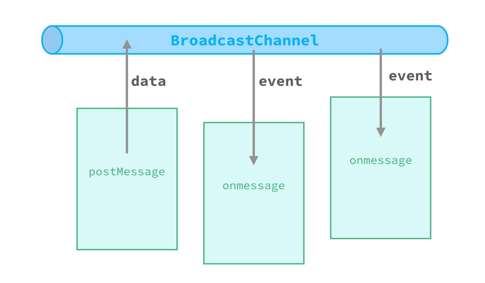

<!-- toc -->

> The `BroadcastChannel` is available since <span class="api-version">v0.9+</span>.

As mentioned in [JS Runtime Context](./runtime-context.html), Weex is using different context for each page, even global variables are isolated, but `BroadcastChannel` is a way to achieve cross-page communication.

## API

> *BroadcastChannel* is part of [W3C specifications](https://html.spec.whatwg.org/multipage/comms.html#broadcasting-to-other-browsing-contexts), as well as the [MessageEvent](https://html.spec.whatwg.org/multipage/comms.html#messageevent).

The constructor of `BroadcastChannel` only take one single parameter which is the channel name.

```js
const jb = new BroadcastChannel('007')
```

The type declaration of the `BroadcastChannel` is:

```typescript
declare interface BroadcastChannel = {
  name: string,
  postMessage: (message: any) => void;
  onmessage: (event: MessageEvent) => void;
  close: () => void;
}
```

+ `name`: The channel name, it's the indicator when broadcast messages.
+ `postMessage`: Sends the given message to other BroadcastChannel objects set up for this channel.
+ `onmessage`: The event handler. An event will be triggered when the instance received a message.
+ `close`: Closes the BroadcastChannel object, opening it up to garbage collection.

The type declaration of the `MessageEvent` is:

```typescript
declare interface MessageEvent = {
  type: string, // "message"
  data: any
}
```

## Communication Procedure



Just like using radio, each client joins a specific channel by creating a `BroadcastChannel` object with the same channel name. Then implement the `onmessage` event handler to listen on the underlying channel. Call the `postMessage()` method on the BroadcastChannel object will broadcast a message to every subscriber of the channel.

Indeed, it's a full-duplex (bi-directional) communication between all subscriber of the particular channel, each of them is able to receive any message that has been posted to it. Even the sender of the message can receive the message event itself. Communications between different channels will not affect each other.

To leave a channel, it is required to call the `close()` method on the BroadcastChannel object. This method only closed itself, and does not affect other subscribers. When a Weex page is destroyed, all subscribers in it will be closed at `destroyInstance`. If all subscribers of a channel are closed, the underlying channel would be destroyed and allows garbage collection to happen.

## Usage Example

In page A:

```js
const Steve = new BroadcastChannel('Avengers')
Steve.postMessage('Assemble!')
```

In page B:

```js
const Hulk = new BroadcastChannel('Avengers')
```

In page C:

```js
const Stack = new BroadcastChannel('Avengers')
Stack.onmessage = function (event) {
  console.log(event.data) // Assemble!
  Stack.postMessage('I am Tony and I am leaving now.')
}
```

The page A, B and C are all create a BroadcastChannel object which is listening on the `'Avengers'` channel. They can use it to communicate with each other.

When Steve post the message `'Assemble!'`, Stack will receive a message event whose `data` equals the `'Assemble!'`, and then send another message back. But Hulk will not receive the message because he does not implement the `onmessage` method, so he is not a subscriber actually.

## Notice

> **The `message` object is not deep cloned.** (This feature could be changed.)

In page A:

```js
const a = new BroadcastChannel('app')
const list = ['A', 'B']
a.postMessage(list)
```

In page B:

```js
const b = new BroadcastChannel('app')
b.onmessage = function (event) {
  // the event.data is a reference of list in page A
  event.data.push('C')
}
```

In this case, the `event.data` in page B is a reference of `list` in page A. When pushing a new item `'C'`, it will also affect the `list` object in page A.

Compared to the deep clone, this behavior improves efficiency and reduces memory cost. However, developers are not recommended caching or modifying the `event` object after received it.
